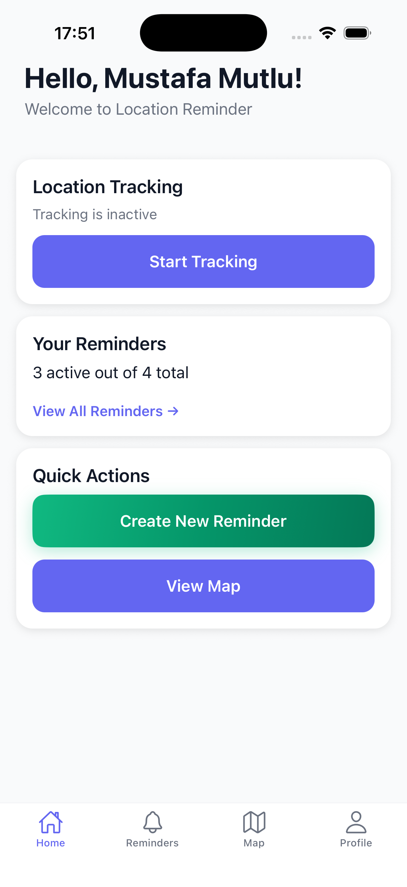
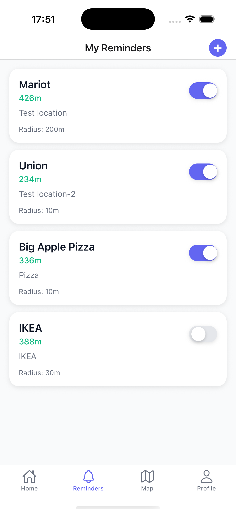
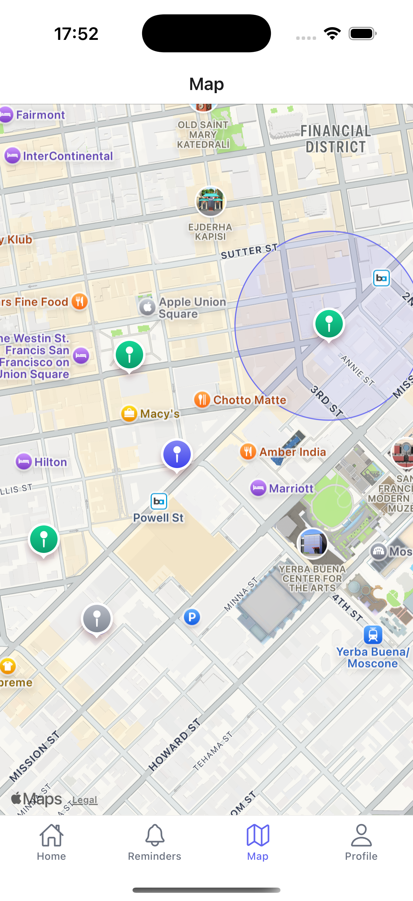
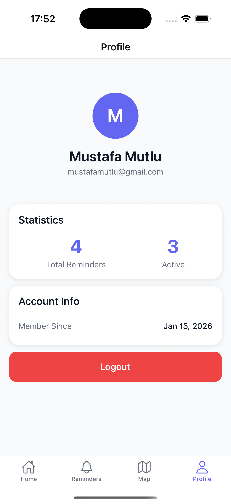

 # 📍 Location Reminder App

A smart location-based reminder application that notifies you when you enter or leave specific geographic areas. Built with React Native and Go, this app helps you never forget important tasks tied to specific locations like "Buy milk when near the grocery store" or "Pick up dry cleaning on the way home."

The application uses geofencing technology to continuously monitor your location in the background and triggers notifications when you enter the radius of your saved reminders. Unlike traditional time-based reminders, location reminders are contextual and trigger exactly when you need them - when you're actually at the right place. The system calculates real-time distances using the Haversine formula, ensuring accurate proximity detection with customizable radius settings from 10 to 10,000 meters.

Built with a modern tech stack, the backend runs on Go with Gin framework for high-performance API handling, while the mobile app leverages React Native for a smooth cross-platform experience. All location data is securely stored in PostgreSQL, and user authentication is handled via JWT tokens. The app intelligently tracks location history, allowing you to review your movements and understand your reminder trigger patterns.

## ✨ Features

- 📍 **Geofencing Technology** - Automatic location monitoring with customizable radius
- 🔔 **Smart Notifications** - Get reminded when you enter or leave specific areas
- 🗺️ **Interactive Map** - Visual interface to set reminder locations
- 📝 **Reminder Management** - Create, edit, and organize location-based tasks
- 📊 **Location History** - Track your movement patterns and reminder triggers
- 🔐 **Secure Authentication** - JWT-based user authentication system
- ⚡ **Real-Time Updates** - Instant location processing and reminder checks
- 📱 **Cross-Platform** - Works seamlessly on both iOS and Android
- 🎯 **Precision Control** - Set custom radius from 10m to 10km for each reminder
- 💾 **Offline Support** - Local data caching for uninterrupted experience

## 📱 Screenshots

<div align="center">

| Home Screen | Reminder List | Edit Reminder |
|-------------|---------------|---------------|
|  |  |  |

| Map View | Profile | Push Notification |
|----------|---------|-------------------|
|  |  |  |

</div>

## 🛠️ Tech Stack

### Backend
- **Go** - High-performance backend language
- **Gin** - Fast HTTP web framework
- **PostgreSQL** - Robust relational database
- **JWT** - Secure token-based authentication
- **bcrypt** - Password hashing

### Frontend
- **React Native** - Cross-platform mobile framework
- **TypeScript** - Type-safe JavaScript
- **React Navigation** - Native navigation solution
- **Redux/Context API** - State management
- **React Native Maps** - Interactive map component
- **Geolocation API** - Background location tracking
- **Push Notifications** - Firebase Cloud Messaging (FCM)

## 🚀 Getting Started

### Prerequisites

- Go 1.21 or higher
- Node.js 20.x or higher
- PostgreSQL 14 or higher
- React Native CLI
- Xcode (for iOS) or Android Studio (for Android)

### Backend Setup

1. **Clone the repository**
```bash
git clone https://github.com/mustafamutlu/location-reminder-app.git
cd location-reminder-app/backend
```

2. **Install Go dependencies**
```bash
go mod download
```

3. **Setup PostgreSQL database**
```bash
# Create database
createdb location_reminder_db

# Run migrations
psql -U postgres -d location_reminder_db -f migrations/init.sql
```

4. **Configure environment variables**
```bash
cp .env.example .env
# Edit .env with your database credentials
```

5. **Run the backend server**
```bash
go run cmd/main.go
```

The API server will start at `http://localhost:8080`

### Frontend Setup

1. **Navigate to the app directory**
```bash
cd ../LocationReminderApp
```

2. **Install dependencies**
```bash
npm install
```

3. **Install iOS dependencies (macOS only)**
```bash
cd ios && pod install && cd ..
```

4. **Configure API URL**
```typescript
// src/config/api.ts
export const API_URL = 'http://YOUR_API _URL_HERE/api';
```

5. **Run the app**

For iOS:
```bash
npx react-native run-ios
```

For Android:
```bash
npx react-native run-android
```

## 🔒 Security Features

- JWT token-based authentication
- Password hashing with bcrypt
- SQL injection prevention with parameterized queries
- CORS protection
- Request validation and sanitization
- Secure location data handling

## 🌟 Key Features Explained

### Geofencing Algorithm

The app uses the Haversine formula to calculate the great-circle distance between two points on Earth:
```go
distance = 2 * R * arcsin(√(sin²(Δlat/2) + cos(lat1) * cos(lat2) * sin²(Δlon/2)))
```

This provides accurate distance calculations accounting for Earth's curvature.

### Background Location Tracking

The app uses native location services to monitor your position even when the app is in the background, ensuring you receive notifications at the right time.

### Smart Notification System

Notifications are triggered only when:
1. You enter a reminder's geofence radius
2. The reminder is active
3. You haven't been notified recently for the same reminder

## 📝 License

This project is licensed under the MIT License - see the LICENSE file for details.

## 👨‍💻 Developer

**Mustafa Mutlu**

- GitHub: [@mustafamutlu](https://github.com/mmutlucod)
- LinkedIn: [Mustafa Mutlu](https://linkedin.com/in/mustafamutluu)

